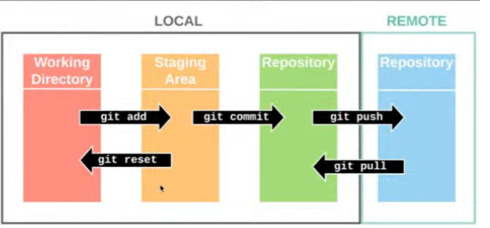

# Isabelle Shaw Nelson - Foundation Exam 

### 1.1 Explain the difference between a primary key and a foreign key (2marks)

Primary  and foreign keys are used in relational databasing. 

A primary key is a collumn (or set of collumns) in a table that uniquely identies each row - no two rows can have the same value. These values are not likely to change their meaning and they cannot be null. 

On the other hand, a foreign key is used to link a column or group of columns in one table to a collumn or group of collumns in another table. This is used to maintain relatioships between related tables. The values in the forign key column of one table must corresspond to (are dependent on) the values in the linked collumn of another table. It is not possible to add a value into a forign key collumn that does not already exist in the linked collumn.

### 1.2   What is the role of the `finally` block in Python exception handling and how would you use it (2marks) 
The `finally` block is used in exception handling within a `try-except-finally` block. It is used to manage all conditions. 

In a `try-except-finally` block, the `try` block first runs the code that is being monitored for exceptions. If no exception block arises, the finally block will run. 

Any `except` blocks will then run. The `finally` wil execute after any exception block has run.   

The `finally` block will always execute after all `try` and `execute` blocks have run, regardless of if any exceptions arise. 
Note, if no `except` block is specified, the `finally` block will run immediately after the `try` block (see below). 

### 1.3  Explain the difference between a commit and a push in Git. (2marks)

`Commit` is used to save changes to a local repository. The command `git push` is used to do this. A message should be added to the commit  
describing the changes made in a manner that can be understood by other developers. 
`Push` is used to upload content from a local repository to a remote repository (e.g. a repositry on github). 

### 1.4   Explain the difference between undefined and null in JavaScript (2marks)

`Undefined` means that a variable that has not been assigned a value.
`Null` is assigned to a variable when used to represent the absence of a value or 'nothing'. 

### 1.5   Provide examples of two web APIs and describe their functionalities (4marks)
A web API takes allows software applications for exchange data over the internet. It takes requests from client applications, communicates with a server and retrives data or services back to the client.  

1) StarWars API: 
The StarWars API is an open web API that contains information about the Star Wars universe including starships, characters, planets, vehicles, species, films. 
For example, by accessing the 'characters' endpoint, a developer can access information on character's characteristics name, gender, birth year, height etc. This allows developers to use this information in applications, websites and other projects. 

2) OpenWeatherMap API: 
The OpenweatherMap API is an API that gives access to weather forecasts and data for various locations around the world. For example, you can access the "current weather data" endpoint to retrieve real-time weather conditions for a specific location. You could also access the "Historical Weather Data" endpoint access historical weather data. 

### 1.6   Describe four tasks in the role of the Product Owner in Agile development (4marks)

Agile development is an itterative process. Tasks a product owner might undertake include: 

1)  Decide and outline what kind of product or software is to be built. They might collaborate with stakeholders and analyse makret needs to determien this.  

2) Collect feedback from customers and stakeholders about the product in its various forms following various itterations of rollout. They will then provide this feedback to the development team and use it to inform their next task:

3) Create and manage a prioritised list of features that should be added to the software or ways the software should be improved known as the Product Backlog. The development team will refer to this when planning their next sprint. 

4) Attend sprint planning meetings to identify which high priority items should be progressed within one development sprint. This list is called the sprint backlog.   

5) Attend sprint review meetings. This is where the product team would present their completed work to various stakeholders inclduing the product owner. The product owner would provide feedback and help establish prioritisation and adjustments int he next steps.   

### 1.7   Name two types of SQL joins and provide an example scenario for each. (4 marks)

### 1) Inner join:

An inner join is used in SQL to join the collumns of two tables together. This join combines rows with matching values.
 
An example of this is shown below: 
If the two following tables exist in a database with the following collumns: 

a) Owners Table:
Columns: OwnerID, FirstName, LastName, Email, Phone, Address.  

    
b) Pets Table:
Columns: PetID, PetName, OwnerID (with a foreign key referencing the collumn of the same name in the Owners table), Species, Breed, Age. 

You could use an inner join to retrieve a table that contains a list of pets along with their owners' information (first names, last names, and contact details) using the following code: 

`SELECT Pets.PetID, Pets.PetName, Owners.FirstName, Owners.LastName, Owners.Email, Owners.Phone`

`FROM Pets
INNER JOIN Owners ON Pets.OwnerID = Owners.OwnerID;`

### 2) Left Outer Join

A left inner join returns all rows from one table (on the left of the output table) and only the matching rows from the right table based on the join condition. 
For the example above, this could be used to produce a list of all pets, including ones don't have an assigned owner yet, as well as their owner's information if they have one. This could be achived with the follwoing code: 

`SELECT Pets.PetID, Pets.PetName, Owners.FirstName, Owners.LastName, Owners.Email, Owners.Phone`

`FROM Pets
LEFT JOIN Owners ON Pets.OwnerID = Owners.OwnerID;`

### 1.8    Explain the difference between mutable and immutable data types in Python, provide an example of each. (4marks)

Mutable data can be changed or modified after it is created. Immutable data types cannot be be altered once created. 

An example of a mutable data type is a list which could be changed or appended to as in the code below: 

`alphabetList = ["a", "b", "c"]
print(alphabetList)`

Will result in Output: 

`["a", "b", "c"]`

`alphabetList.append("d")
print(alphabetList) `

`Output: ["a", "b", "c", "d"]`

An example of immutable data is a turple. It is not possible to change. For example: 

`tupleExample = (1, 2, 3, 4, 5)
print(tupleExample)`

`Output: (1, 2, 3, 4, 5)`

If you tried to chnage the turple as below: 
`my_tuple[0] = 100`

This would result in a `TypeError`. 

### 1.9  What is the difference between synchronous and asynchronous functions? (2marks)
Synchronous functions are executed sequentially or one after another in blocks. The program waits until the function has completed its task before moving on to the next line of code.
 
Asynchronous functions can be executed simultaneously. This allows the program to continue executing other tasks while waiting for operations initated earlier to complete.

### 1.10 Describe four differences between agile and waterfall software development methodologies (4 marks)

Four differences include: 
1) Iterative vs linear approach: 
The Agile methodology consists of an Iterative approach. Projects are broken up into smaller work packages called sprints. Following feedback from the product owner and other stakeholders, the product backlog is updated. A linear project path is not outlined at the products conception.  
On the other hand, a Waterfall methodology takes a linear, sequential approach. A more detailed plan is made in the initial stages which includes distinct stages (such as design, implementation, testing, deployment). No iterations of the product requirements occur. 

2) Management of Risk 
Using the Agile method, early and frequent risk identification and mitigation is promoted. Continuous testing and feedback loops are used to resolve issues early. A waterfall method addresses risks later in the product lifecycle. Testing and validation occurs later in the development process. 

3) Collaboration 
During an Agile methodology, collaboration occurs with the product owner, stakeholders and customers multiple times throughout the process. In a waterfall method less communication and feedback occurs. Communication usually happens through formal documentation and status reports rather than via regular interaction. 

4) Adaptability 
Using the Agile method, the product requirements can change and evolve throughout the project following feedback after each sprint. Using a waterfall method, the product requirements are outlined more fully at project conception. Its more challenging to implement changes or evolve the project as it progresses. 
